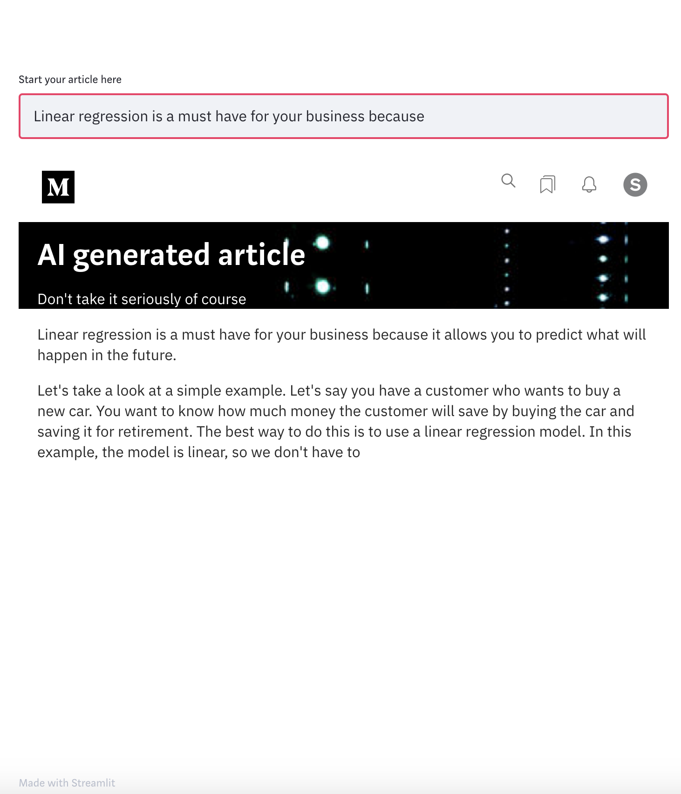

# AI-Generated blog articles

______

A one-afternoon project playing around 🤗-transformers (especially finetuning GP2), Streamlit and webscrapping.
The overall aim was to automatically generate Medium-like articles about data science & its business impact.

Steps involved in this process are :
- Building-up a dataset thanks to web scrapping. I actually scrapped BCG Gamma's Medium blog posts.
- Finetuning a pre-trained language model (here GPT2) and playing around with the 🤗-transformers library.
- Playing around with Streamlit to build an interface to interact with the model + a bit of HTML & CSS to make the interface look like a medium blogpost

Here is an idea of what the interface looks like at the end.

Here are some examples sampled from the model :

\[Input\]: `Data science and machine learning have become`
\[Output\]: 
> Data science and machine learning have become increasingly important in the field of data science. In this article, we will look at a few of the most popular applications of these technologies, and how they can be used to improve the quality of your data.
> What is Data Science and Machine Learning? Data science refers to the process by which data is collected, stored, analyzed and analyzed. It is a process that takes place over a period of time, typically between two to three years. Data scientists use

\[Input\]: `If you have ever wondered why data science`
\[Output\]: 
> If you have ever wondered why data science is so important, here are a few reasons. 
> Data science can help us understand the world around us. We can learn more about ourselves, our environment, and how we interact with others. This is especially true when it comes to health, education, health care, or the environment. The more data we have, the more likely we are to be able to predict what will happen in the future. In other words, we can better understand

I checked if finetuning had any impact on the pre-trained model. It turned out that the fine-tuned model better capture 
the writing style of the blog-posts, e.g. a statement then "In this article, we will look at ... ".
That said if the input is not directly datascience-related the language model won't generate a data science text.

At the end of the day it was a nice side project to play with new tech & libraries.